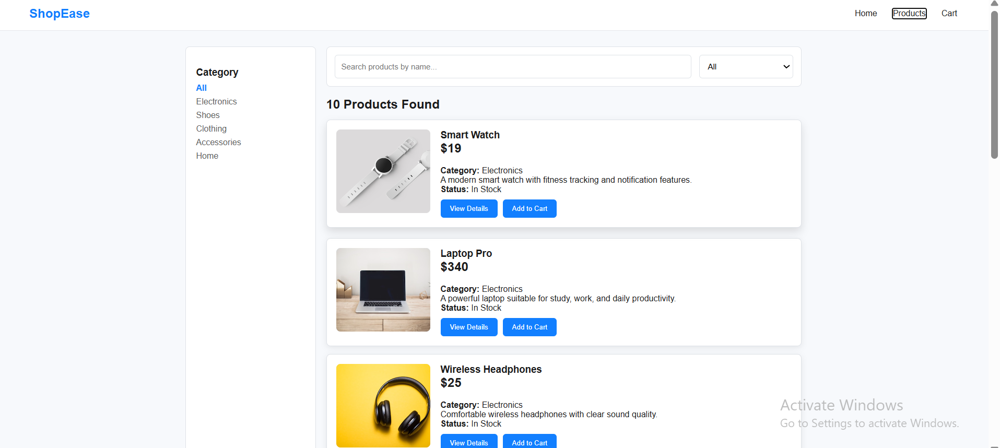
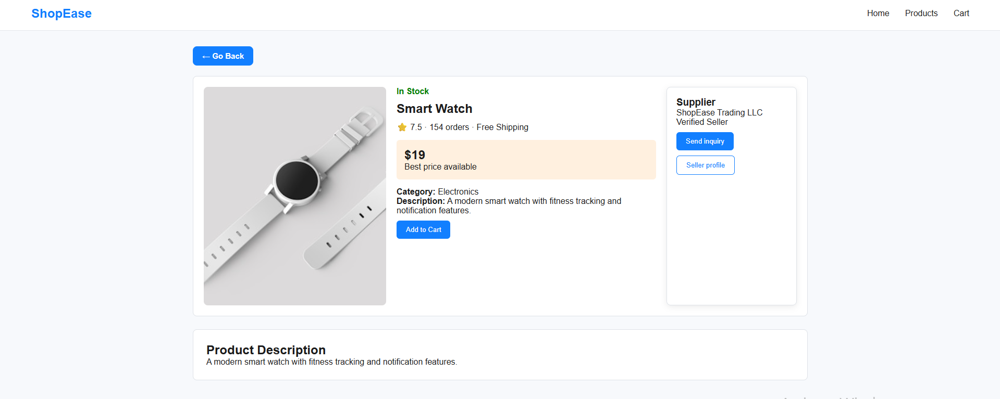
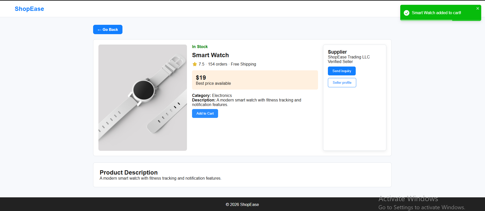
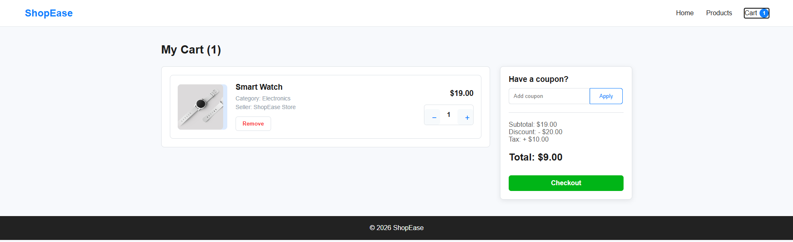
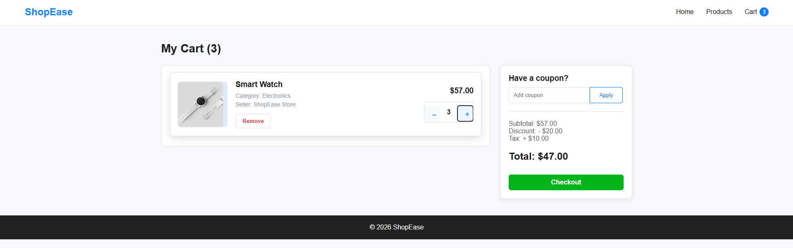
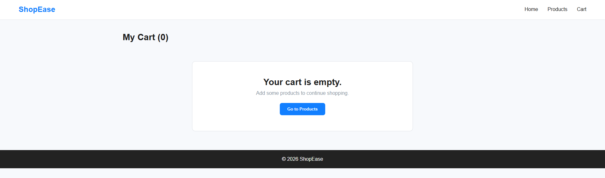

# 🛒 ShopEase Ecommerce Website

A modern React-based Ecommerce Website developed as part of the Frontend Development Internship. This project was built incrementally over multiple weeks by adding new features and improving the application.

---

# 📌 Project Overview

ShopEase is a responsive ecommerce website where users can browse products, search and filter items, view product details, and manage their shopping cart. The project uses local JSON data and React Context API for state management.

---

# 🚀 Technologies Used

- React JS
- React Router DOM
- JavaScript (ES6)
- HTML5
- CSS3
- JSON
- Context API
- localStorage
- React Toastify
- Vite
- Git & GitHub

---

# ✅ Week 1 Features

- Responsive Home Page
- Products Page
- Product Details Page
- Shopping Cart UI
- Navbar
- Footer
- Hero Section
- Product Cards
- Figma-based Design

---

# ✅ Week 2 Features

- Dynamic Product Rendering
- products.json Integration
- React Router Navigation
- Search Functionality
- Category Filter
- Dynamic Product Details Page
- Improved UI & Layout

---

# ✅ Week 3 Features

- Add to Cart Functionality
- Quantity Increase & Decrease
- Remove Item from Cart
- Dynamic Total Price Calculation
- Global State Management using Context API
- Persistent Cart using localStorage
- Navbar Cart Badge
- Toast Notification
- Go Back Button
- Responsive Cart Page

---

# 📂 Folder Structure

```
src/
│
├── components/
│   ├── Navbar/
│   ├── Footer/
│   ├── Hero/
│   └── ProductCard/
│
├── context/
│   └── CartContext.jsx
│
├── data/
│   └── products.json
│
├── pages/
│   ├── Home/
│   ├── Products/
│   ├── ProductDetails/
│   └── Cart/
│
├── App.jsx
├── main.jsx
└── index.css
```

---

# 📸 Screenshots

## Week 2

### Home Page


### Products Page


### Product Details


---

## Week 3

### Products Page



### Product Details



### Add to Cart Toast



### Shopping Cart



### Quantity Update



### Empty Cart



---

# 📚 Learning Outcomes

- React Components
- React Router
- Dynamic Rendering
- Context API
- localStorage
- State Management
- Responsive Design
- Git & GitHub Workflow

---

# 🔮 Future Improvements

- User Authentication
- Wishlist
- Payment Gateway
- Backend Integration
- Order History
- Product Reviews

---

# 👩‍💻 Author

**Arpita Saha**


GitHub:
https://github.com/arpita201

---


