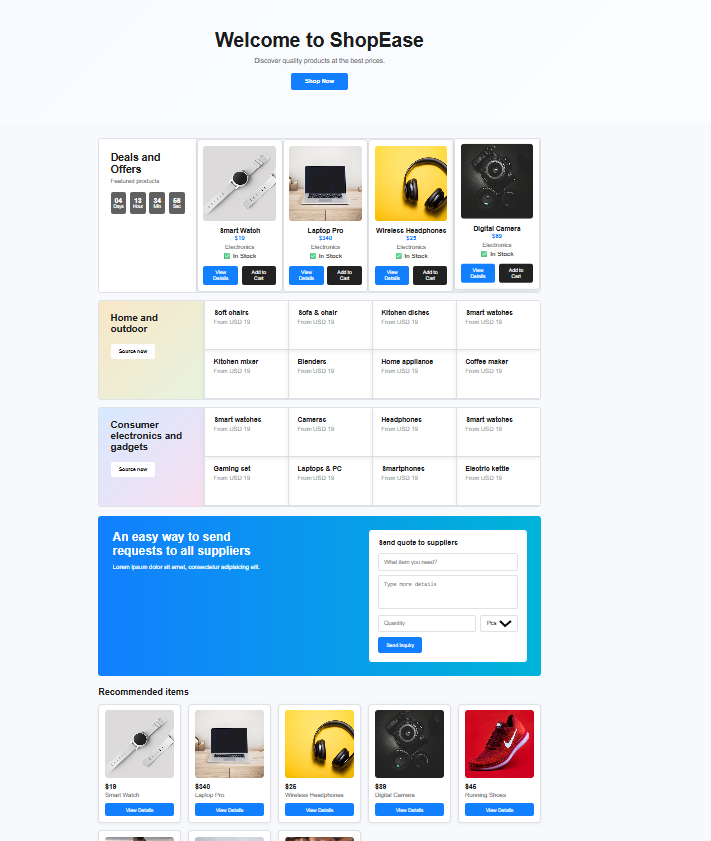
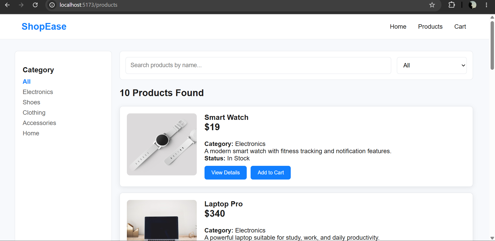
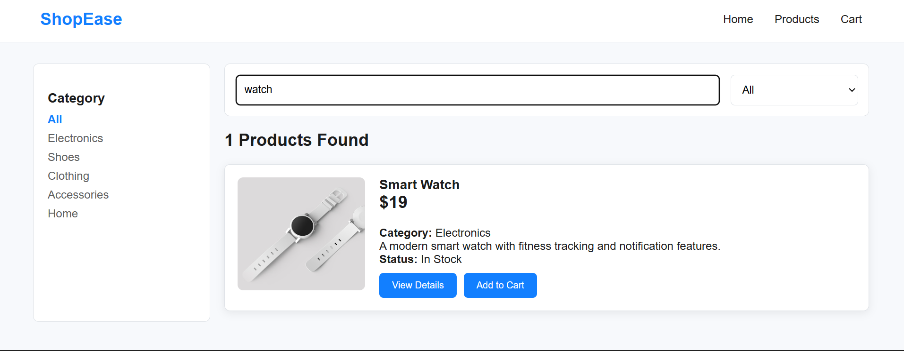
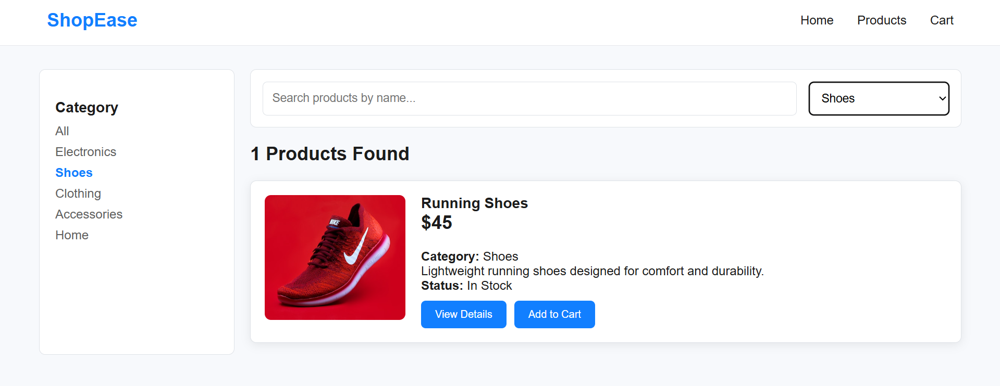
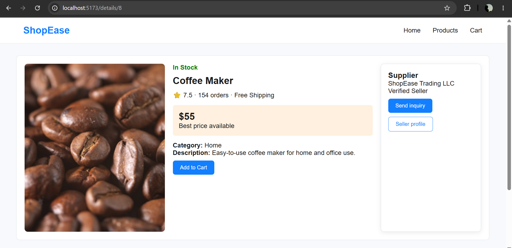
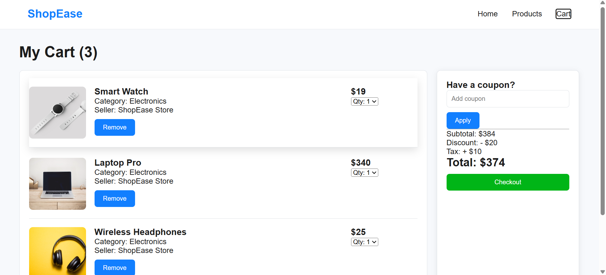

# 🛍️ ShopEase Ecommerce Website

A modern and responsive Ecommerce Website built with **React JS** and **Vite**. This project demonstrates a complete frontend shopping experience with dynamic product rendering, search, category filtering, product details, and shopping cart functionality.

---

## 🚀 Live Features

### ✅ Week 1 Features
- Responsive Navigation Bar
- Home Page
- Products Listing Page
- Product Details Page
- Shopping Cart Page
- Responsive Layout
- React Router Navigation
- Reusable Components
- Clean UI Design

### ✅ Week 2 Features
- Dynamic Product Rendering using JSON
- Product Details using Dynamic Route
- Search Products by Name
- Category Filter
- Search + Filter Combined
- Add to Cart Button
- Remove Item from Cart
- Quantity Update
- Dynamic Price Calculation
- Dynamic Subtotal
- Dynamic Total Price
- Responsive Design

---

# 🛠 Technologies Used

- React JS
- React Router DOM
- JavaScript (ES6)
- HTML5
- CSS3
- JSON
- Vite
- Git
- GitHub

---

# 📁 Project Structure

```
src
│
├── components
│   ├── Hero
│   ├── Navbar
│   ├── ProductCard
│   └── Footer
│
├── data
│   └── products.json
│
├── pages
│   ├── Home
│   ├── Products
│   ├── ProductDetails
│   └── Cart
│
├── App.jsx
└── main.jsx
```

---

# 📸 Screenshots

## 🏠 Home Page



---

## 📦 Products Page



---

## 🔍 Search Feature



---

## 🗂 Category Filter



---

## 📄 Product Details



---

## 🛒 Shopping Cart



---

# ⚙️ Installation

### Clone the repository

```bash
git clone https://github.com/arpita201/shopease-ecommerce.git
```

### Go to project folder

```bash
cd shopease-ecommerce
```

### Install dependencies

```bash
npm install
```

### Run the project

```bash
npm run dev
```

---

# 📚 What I Learned

- React Components
- Props
- React Router
- Dynamic Routing
- JSON Data Rendering
- Search Functionality
- Category Filtering
- React State (useState)
- Array Methods (map, filter)
- Responsive UI Design
- Git & GitHub Workflow

---

# 🚀 Future Improvements

- User Authentication
- Wishlist
- Backend Integration
- Database Support
- Payment Gateway
- Order History
- Product Reviews
- Local Storage Cart
- API Integration

---

# 👩‍💻 Developed By

**Arpita Saha**

t

GitHub: https://github.com/arpita201

Repository:
https://github.com/arpita201/shopease-ecommerce

---
