# 🛒 ShopEase Ecommerce Website

A modern React-based Ecommerce Website developed as part of the Frontend Development Internship. This project was built incrementally over multiple weeks by adding new features and improving the application.

---

# 📌 Project Overview

ShopEase is a responsive ecommerce website where users can browse products, search and filter items, view product details, manage their shopping cart, authenticate users, and fetch product data from a backend API connected to MongoDB.

---

# 🚀 Technologies Used

## Frontend

- React JS
- React Router DOM
- JavaScript (ES6)
- HTML5
- CSS3
- React Context API
- localStorage
- React Toastify
- Vite

## Backend

- Node.js
- Express.js
- MongoDB Atlas
- Mongoose
- dotenv
- CORS

## Tools

- Git
- GitHub
- Postman


---

# ✅ Week 1 Features

- Responsive Home Page
- Products Page
- Product Details Page
- Shopping Cart UI
- Navbar
- Footer
- Hero Section
- Product Cards
- Figma-based Design

---

# ✅ Week 2 Features

- Dynamic Product Rendering
- products.json Integration
- React Router Navigation
- Search Functionality
- Category Filter
- Dynamic Product Details Page
- Improved UI & Layout

---

# ✅ Week 3 Features

- Add to Cart Functionality
- Quantity Increase & Decrease
- Remove Item from Cart
- Dynamic Total Price Calculation
- Global State Management using Context API
- Persistent Cart using localStorage
- Navbar Cart Badge
- Toast Notification
- Go Back Button
- Responsive Cart Page

# ✅ Week 4 Features

- Login Page
- Signup Page
- Show / Hide Password
- Frontend Form Validation
- Email Validation
- Password Validation
- Confirm Password Validation
- Checkout Page
- Shipping Information Form
- Order Summary
- User Authentication using localStorage
- Protected Checkout (Login Required)
- Order Success Page
- Logout Functionality
- Active Navigation using NavLink
- Responsive Login, Signup & Checkout Pages

---

# ✅ Week 5 Features

- Backend Integration using Node.js & Express.js
- MongoDB Atlas Database
- Product Model using Mongoose
- REST API Development
- GET /api/products
- GET /api/products/:id
- Frontend Connected with Backend API
- Products fetched from MongoDB
- Dynamic Product Details from Backend
- Loading State Handling
- Error State Handling
- Environment Variables using dotenv
- CORS Configuration

---

# 📂 Folder Structure

```text
shopease-ecommerce/
│
├── backend/
│   ├── models/
│   ├── routes/
│   ├── server.js
│   ├── seedProducts.js
│   ├── package.json
│   └── .env
│
├── public/
├── screenshots/
├── src/
│   ├── components/
│   ├── context/
│   ├── pages/
│   ├── App.jsx
│   └── main.jsx
│
├── package.json
└── README.md
```

---

# 📸 Screenshots

## Week 2

### Home Page
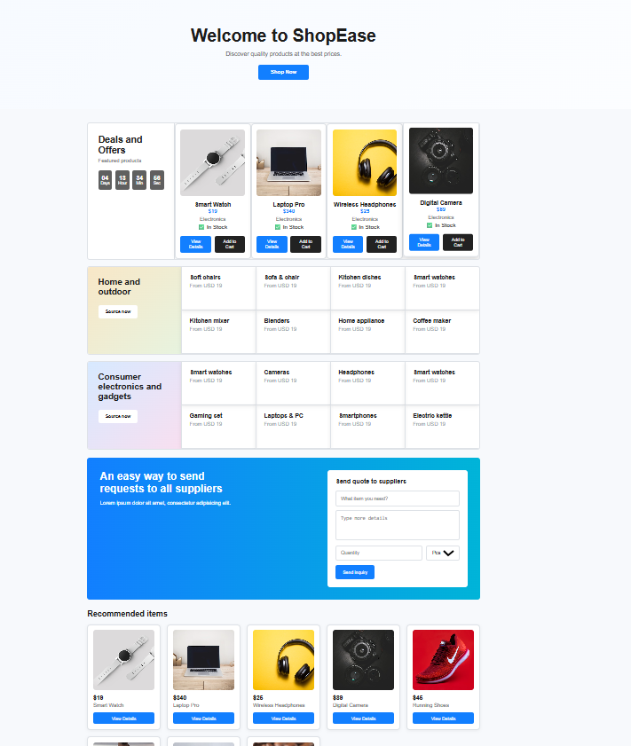

### Products Page
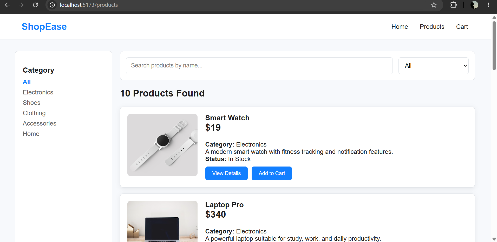

### Product Details
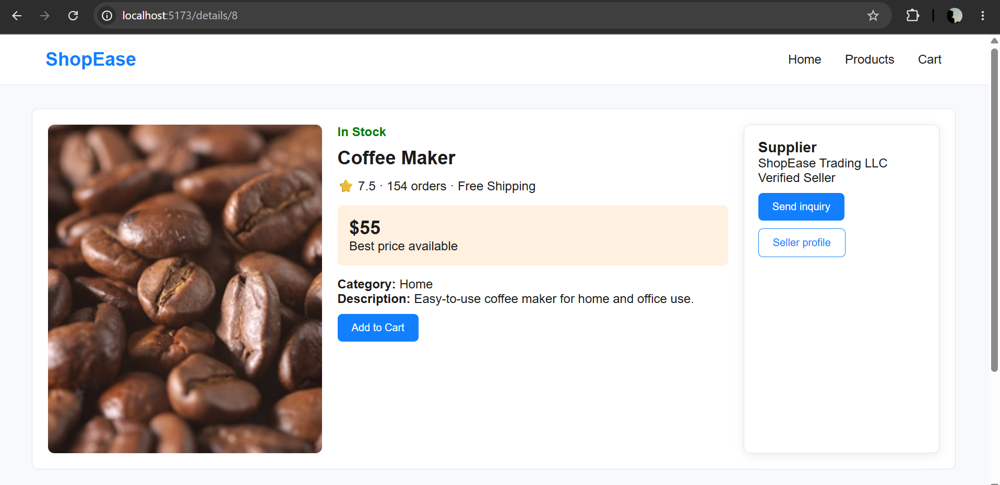

### Search Feature
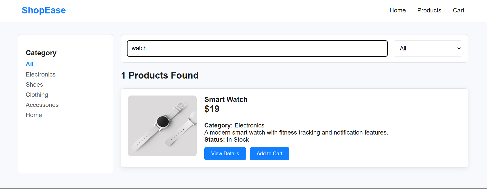

### Category Filter
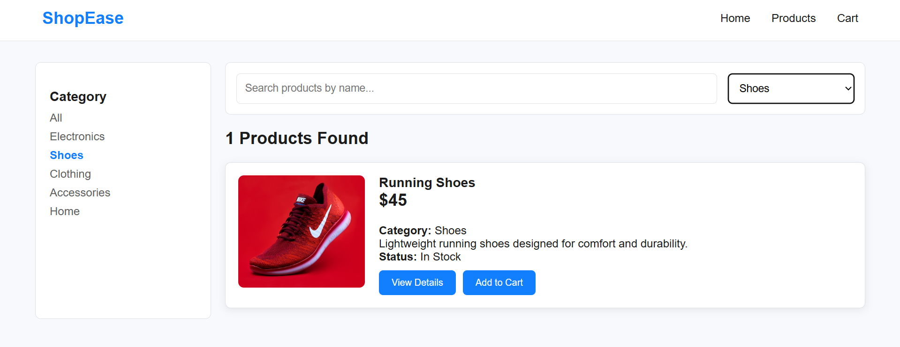

### Cart Page
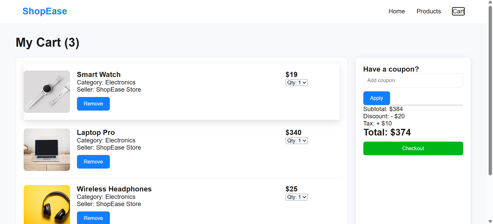

---

## Week 3

### Products Page
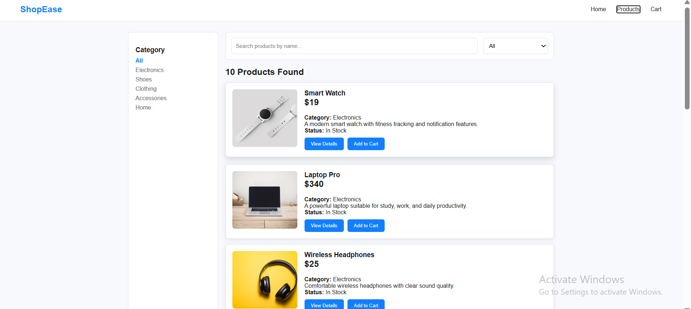

### Product Details
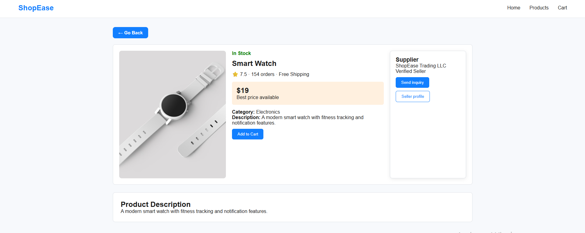

### Add to Cart Toast
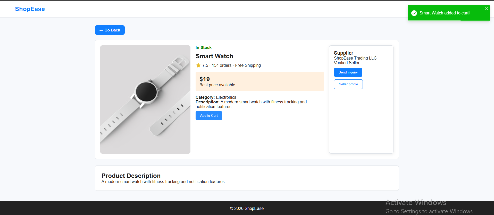

### Shopping Cart
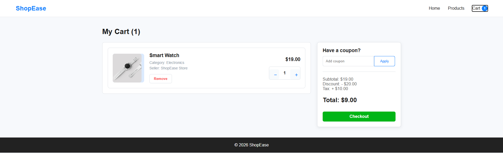

### Quantity Update
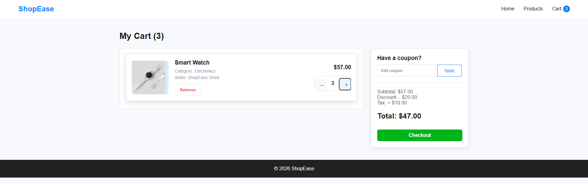

### Empty Cart
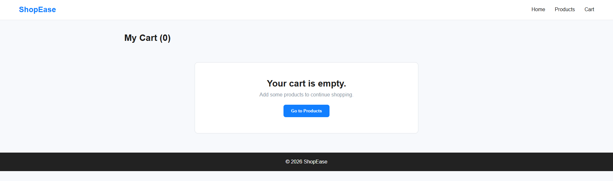

---

## Week 4

### Login Page
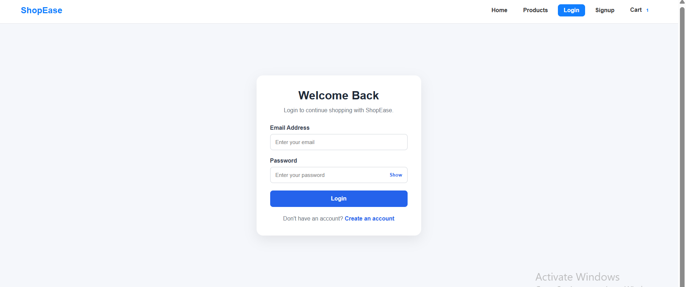

### Login Validation
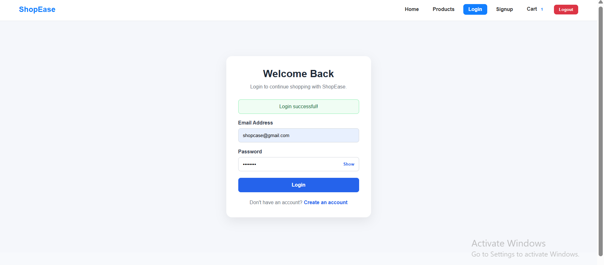

### Signup Page
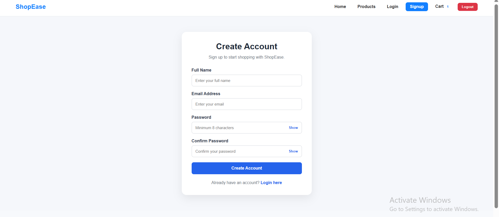

### Signup Validation
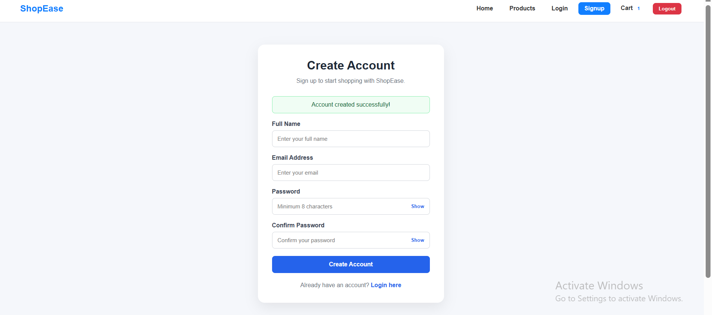

### Checkout & Order Summary
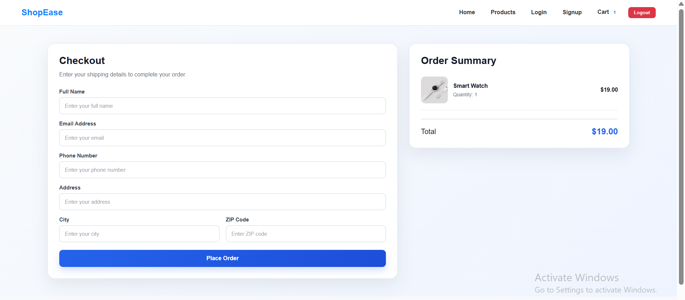

### Order Success
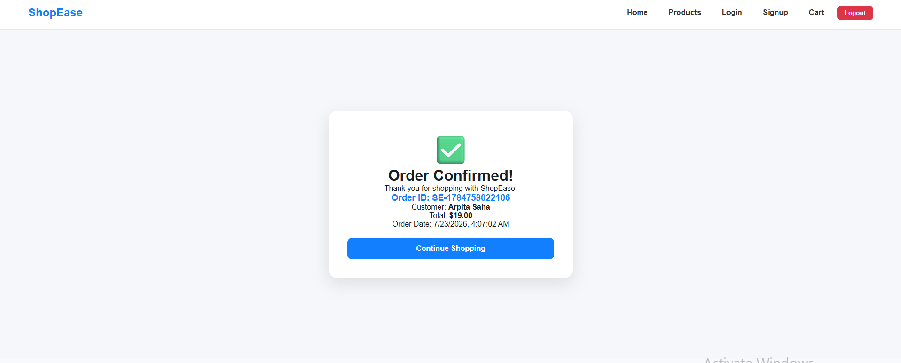


---

## Week 5

### Home Page (Backend API)
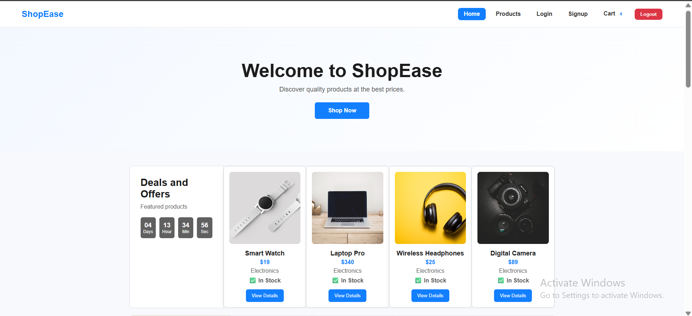

### Products Page (Backend API)
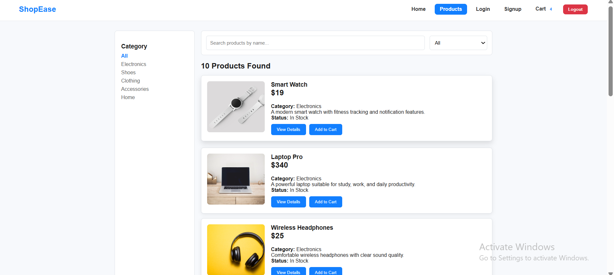

### Product Details (Backend API)
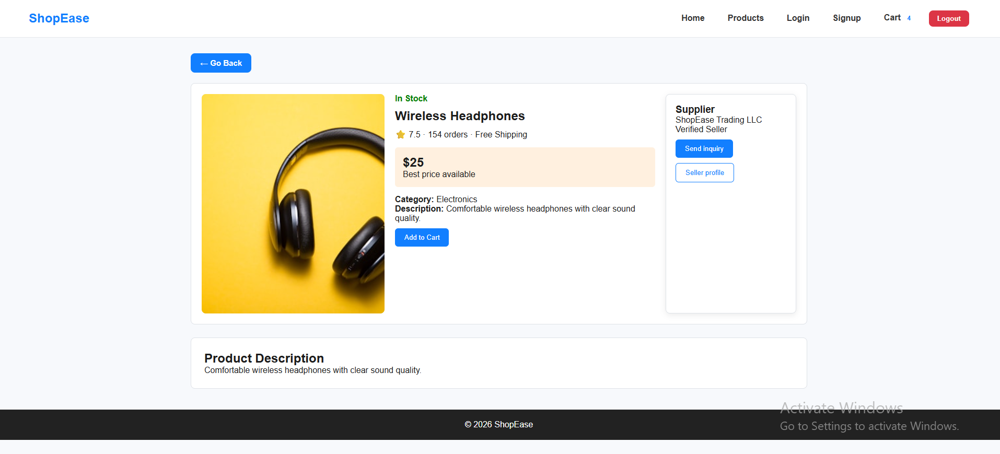

### API - Get All Products
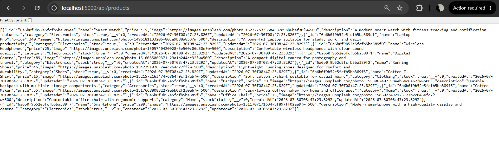

### API - Get Single Product
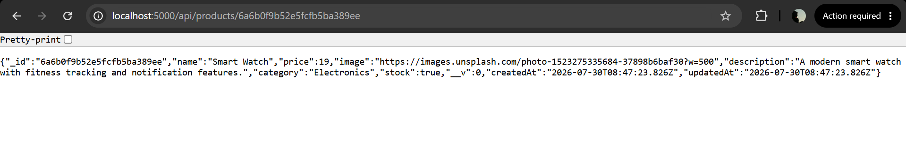

### MongoDB Atlas Database
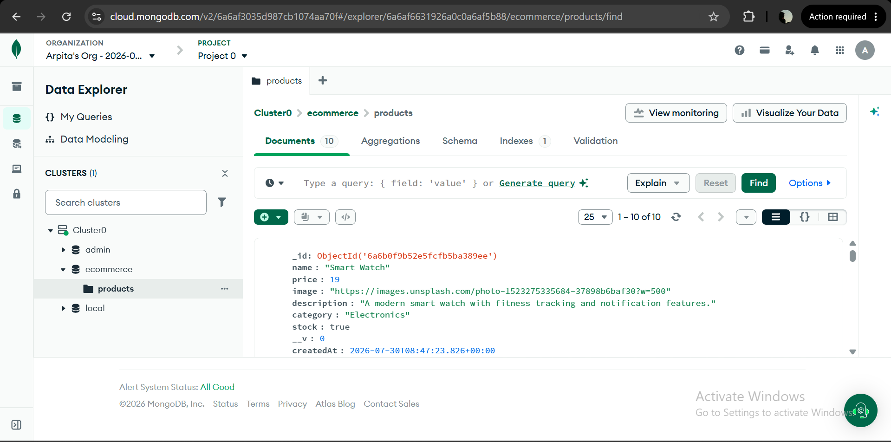

# ⚙️ Installation

## Frontend

```bash
npm install
npm run dev
```

Open:

```
http://localhost:5173
```

---

## Backend

```bash
cd backend
npm install
npm run dev
```

Server runs at:

```
https://shopease-backend-ipy9.onrender.com
```

---

# 🔗 API Endpoints

### Get All Products

```
GET /api/products
```

Returns all products from MongoDB.

### Get Single Product

```
GET /api/products/:id
```

Returns a single product using MongoDB ObjectId.

# 🔐 Environment Variables

Create a `.env` file inside the backend folder.

Example:

```env
MONGO_URI=your_mongodb_connection_string
PORT=5000
```

# 📚 Learning Outcomes

- React Components
- React Router
- Dynamic Rendering
- Context API
- localStorage
- State Management
- Responsive Design
- Git & GitHub Workflow
- Form Validation
- User Authentication
- Protected Checkout Flow
- Authentication using localStorage
- REST API Development
- Express.js
- MongoDB Atlas
- Mongoose
- Backend Integration
- Environment Variables
- CORS
---

# 🔮 Future Improvements

- JWT Authentication
- Payment Gateway Integration
- Wishlist
- User Profile
- Order History
- Product Reviews
- Admin Dashboard
---

# 👩‍💻 Author

**Arpita Saha**


GitHub:
https://github.com/arpita201

---


